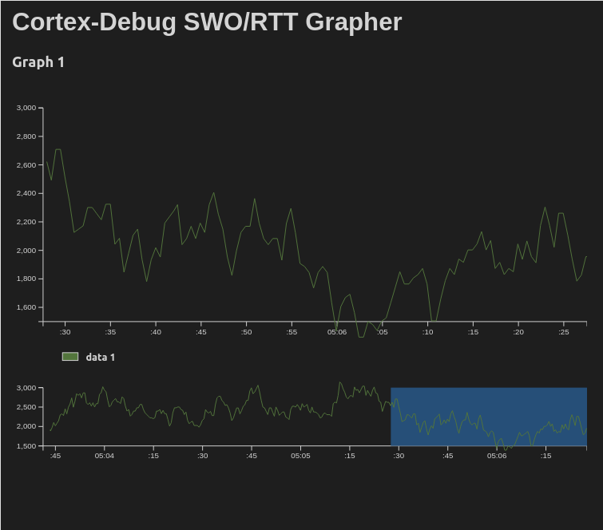

# RTT

[](https://github.com/reznikmm/rtt/actions/workflows/alire.yml)
[](https://alire.ada.dev/crates/rtt.html)
[](https://api.reuse.software/info/github.com/reznikmm/rtt)

> Real Time Transfer implementation in Ada for embedded systems



Real Time Transfer (RTT) is an interface specified by
[SEGGER](https://www.segger.com/) based on basic memory reads and
writes to transfer data bidirectionally between target and host. The
specification is independent of the target architecture. Every target
that supports "background memory access" (the target memory can be
accessed by the debugger while the target is running) can be used.

RTT provides a flexible and efficient solution for logging and data
transfer in real-time during embedded development. It allows
transferring both text and binary data with minimal latency and high
performance, without interrupting program execution and without
requiring additional hardware.

The RTT method works by writing log data to a circular buffer on the
target device, which is then read by the debugger without interrupting
program execution. Since the target board is already connected to the
debugger, no additional devices or connections are needed. This
universal method is platform-independent - all that's required is a
debugger capable of reading and writing the target device's memory
contents without stopping the CPU.

RTT is supported in [OpenOCD](https://openocd.org/) starting from
version 0.11, and in various IDEs including VS Code through the
[Cortex Debug](https://github.com/Marus/cortex-debug) extension.

## Features

- Multiple independent data streams (buffers)
- Bidirectional data transfer (target ↔ host)
- Configurable buffer operating modes (skip, trim, or block)
- Support for both text and binary data
- Low overhead - can be used even from interrupt handlers
- No special hardware requirements beyond debugger connection
- Support for OpenOCD and J-Link debuggers

## Install

Add `rtt` as a dependency to your crate with Alire:

```sh
alr with rtt
```

## Usage

The driver implements two usage models: the [`RTT`](source/rtt.ads)
package for direct control, and the [`RTT.IO`](source/rtt-io.ads)
package which provides a simpler interface with pre-configured
buffers.

### Using RTT.IO (Recommended for most cases)

The simplest way to use RTT is through the
[`RTT.IO`](source/rtt-io.ads) package, which provides a ready-to-use
interface:

```ada
with RTT.IO;

procedure Main is
begin
   RTT.IO.Put_Line ("Hello, Ada!");
   RTT.IO.Dump (42, Buffer => 2);  -- Binary data for graphing
end Main;
```

The [`RTT.IO`](source/rtt-io.ads) package automatically creates a
control block with the required buffers. The number of buffers is
configured through Alire configuration variables (see Configuration
section).

### Using RTT Package Directly

For more control, you can use the [`RTT`](source/rtt.ads) package
directly:

```ada
with RTT;
with Interfaces.C;

procedure Main is
   Terminal : constant Interfaces.C.char_array :=
     "Terminal" & Interfaces.C.nul;
   Terminal_Output : RTT.Byte_Array (1 .. 256);

   Control_Block : aliased RTT.Control_Block :=
     (Max_Up_Buffers   => 1,
      Max_Down_Buffers => 0,
      Up               =>
        (1 => (Name    => Terminal'Address,
               Buffer  => Terminal_Output'Address,
               Size    => Terminal_Output'Length,
               others  => <>)),
      others           => <>)
        with Export, External_Name => "_SEGGER_RTT";
begin
   RTT.Put_Line ("Hello, World!", Control_Block'Access);
end Main;
```

### Buffer Operating Modes

Each buffer can operate in one of three modes (defined in
[`Operating_Mode`](source/rtt.ads)):

- **No_Block_Skip**: If the buffer is full, all incoming data is
  discarded
- **No_Block_Trim**: If the buffer is full, available space is
  filled and the rest is discarded
- **Block_If_FIFO_Full**: The application waits when the buffer is
  full, preventing data loss but potentially blocking execution

### Available Procedures

The [`RTT`](source/rtt.ads) package provides the following
procedures:

- [`Write`](source/rtt.ads): Write raw byte data to a buffer
- [`Put`](source/rtt.ads): Write a string to a buffer
- [`Put_Line`](source/rtt.ads): Write a string followed by CR+LF to
  a buffer
- [`Dump`](source/rtt.ads): Write binary integer data (useful for
  plotting graphs)

The [`RTT.IO`](source/rtt-io.ads) package provides simplified
versions:

- [`Put`](source/rtt-io.ads): Write a string to the specified buffer
- [`Put_Line`](source/rtt-io.ads): Write a string followed by CR+LF
  to the specified buffer
- [`Dump`](source/rtt-io.ads): Write binary integer data to the
  specified buffer

## Configuration

Configure the number of buffers using Alire configuration variables
in your [alire.toml](alire.toml):

```toml
[configuration.values]
rtt.Up_Buffers = 2    # Number of target-to-host buffers (default: 1)
rtt.Down_Buffers = 0  # Number of host-to-target buffers (default: 0)
```

These values must be between 0 and 9.

## Debugger Setup

### OpenOCD

To use RTT with OpenOCD, you need to configure it to find the control
block and start the RTT server. You can do this either through GDB
commands or in your OpenOCD configuration file.

**Using GDB commands:**

```gdb
monitor rtt setup 0x20004a00 1024 "SEGGER RTT"
monitor rtt start
monitor rtt server start 9090 0
```

**Using OpenOCD configuration file**
([stm32.cfg](examples/stm32_rtt/stm32.cfg)):

```cfg
source [find interface/stlink.cfg]
source [find target/stm32f4x.cfg]
rtt setup 0x20004a00 1024 "SEGGER RTT"
rtt server start 9090 0
```

The first parameter (`0x20004a00`) is the address of the control
block. You can find this address in the map file generated during
build, or you can specify the entire RAM range - OpenOCD will search
for the "SEGGER RTT" identifier.

Now you can receive log data by connecting to port 9090:

```sh
telnet localhost 9090
```

### Cortex Debug (VS Code)

The [Cortex Debug](https://github.com/Marus/cortex-debug) extension
for VS Code provides
[RTT support](https://github.com/Marus/cortex-debug/wiki/SEGGER-RTT-support)
with OpenOCD and J-Link. Data from RTT streams can be displayed both
as text and using the built-in graph plotter.

Configure RTT in your
[launch.json](examples/stm32_rtt/.vscode/launch.json):

```json
{
  "configurations": [
    {
      "executable": "${workspaceFolder}/.obj/main",
      "name": "Debug with OpenOCD",
      "request": "launch",
      "type": "cortex-debug",
      "servertype": "openocd",
      "configFiles": ["interface/stlink.cfg", "target/stm32f4x.cfg"],
      "rttConfig": {
        "enabled": true,
        "address": "auto",
        "decoders": [
          {
            "port": 0,
            "type": "console"
          },
          {
            "type": "graph",
            "port": 1,
            "encoding": "unsigned",
            "graphId": "1",
            "scale": 1
          }
        ]
      },
      "graphConfig": [
        {
          "label": "Graph 1",
          "timespan": 60,
          "type": "realtime",
          "maximum": 8,
          "minimum": 0,
          "plots": [
            {
              "graphId": "1",
              "label": "data 1",
              "color": "#53753c"
            }
          ]
        }
      ]
    }
  ]
}
```

The extension can automatically find the control block if it has the
external name "_SEGGER_RTT" in the debug information.

## Examples

The [examples/stm32_rtt](examples/stm32_rtt) directory contains a
complete example for the STM32F4 board. It demonstrates:

- Using [`RTT.IO`](source/rtt-io.ads) for text output
- Sending binary data for graphing
- Configuration with multiple buffers

To build the example:

```sh
cd examples/stm32_rtt
alr build
```

### GNAT Studio

Launch GNAT Studio with Alire:

```sh
cd examples/stm32_rtt
alr exec gnatstudio
```

### VS Code

Make sure `alr` is in the `PATH`. Open the
[examples/stm32_rtt](examples/stm32_rtt) folder in VS Code. Use
pre-configured tasks to build and flash (requires OpenOCD or
st-util). Install the Cortex Debug extension to launch the
pre-configured debugger.

The example [main.adb](examples/stm32_rtt/src/main.adb) demonstrates
basic usage:

```ada
with Ada.Real_Time;
with RTT.IO;

procedure Main is
   use type Ada.Real_Time.Time;
   Next : Ada.Real_Time.Time := Ada.Real_Time.Clock;
   type Counter is mod 8;
   Step : Counter := 0;
begin
   loop
      RTT.IO.Put_Line ("Hello, Ada!" & Step'Image);
      Step := Step + 1;
      RTT.IO.Dump (Integer (Step), Buffer => 2);
      Next := Next + Ada.Real_Time.Milliseconds (200);
      delay until Next;
   end loop;
end Main;
```

## License

This project is licensed under the BSD-3-Clause license. See
[LICENSES/BSD-3-Clause.txt](LICENSES/BSD-3-Clause.txt) for details.

## Maintainers

- Max Reznik ([@reznikmm](https://github.com/reznikmm))
- Kevin Chadwick ([@kevlar700](https://github.com/kevlar700))