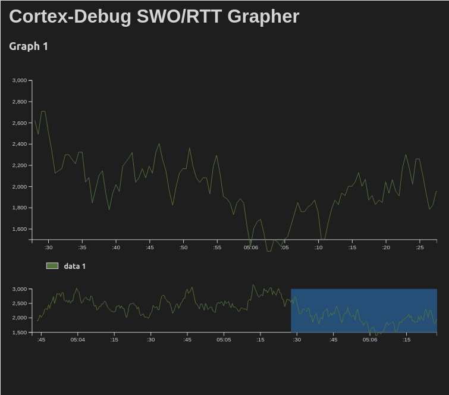

# Бездротовий Put_Line для вбудованих систем
> Використання [RTT](https://wiki.segger.com/RTT) з [OpenOCD](https://openocd.org/) для Ади

Розробка на мові Ада, як і на будь-якій іншій мові програмування, вимагає різноманітних інструментів для забезпечення зручності та продуктивності. Один із важливих аспектів розробки вбудованого програмного забезпечення - це механізм ведення протоколу виконання програми (логування), який дозволяє відстежувати та аналізувати роботу додатка в реальному часі. Логування відіграє ключову роль у виявленні та усуненні помилок, оптимізації продуктивності та забезпеченні безпеки системи.

Існує безліч способів логування, таких як використання UART (послідовний порт) та SWO (Serial Wire Output), які широко застосовуються в різних вбудованих системах. Однак ці методи вимагають спеціальних апаратних засобів як на цільовому пристрої, так і власне у налагоджувачі. З іншого боку, існує метод який не потребує специфічних апаратних можливостей та забезпечує передачу даних в реальному часі з низькою затримкою та високою продуктивністю.

Ідея цього методу дуже проста: дані протоколу записуються в циклічний буфер на цільовому пристрої та зчитуються налагоджувачем, не перериваючи виконання програми. Оскільки цільова плата вже підключена до налагоджувача,
для роботи цього методу не потрібні додаткові пристрої та з'єднання. Цей універсальний метод не залежить від використовуваної платформи - все, що потрібно, це налагоджувач, здатний читати та записувати вміст пам'яті цільового пристрою без зупинки ЦП.

Цей метод підтримується в пристроях та програмному забезпеченні від
[SEGGER](https://www.segger.com/) і відомий як 
[RTT (Real Time Transfer)](https://wiki.segger.com/RTT).
Популярне програмне забезпечення для налагоджуваня вбудованих систем - OpenOCD - почало підтримувати RTT з версії 0.11. Давайте розглянемо, як можна скористатися RTT при розробці на мові Ада.

Метод RTT дозволяє передавати кілька потоків даних одночасно. Кожен потік має свій власний буфер і передає дані лише в одному напрямку: або від цільового пристрою до хосту, або від хоста до цільового пристрою. Поки хост встигає читати дані, зберігаючи буфер не повністю заповненим, робота програми триває своїм шляхом. Існують кілька режимів буфера, які вказують, що станеться, коли буфер переповниться. Залежно від налаштувань, програма або буде ігнорувати нові дані, або перезапише найстаріші дані буфера, або призупинить виконання до появи місця в буфері. Для опису буфера використовуються наступні типи даних:

```ada
type Operating_Mode is (No_Block_Skip, No_Block_Trim, Block_If_FIFO_Full);

type Buffer_Flags is record
   Reserved : Natural range 0 .. 0 := 0;
   Mode     : Operating_Mode := No_Block_Skip;
end record with Size => 32;

for Buffer_Flags use record
   Reserved at 0 range 2 .. 31;
   Mode     at 0 range 0 .. 1;
end record;

type Buffer is limited record
   Name   : System.Address := System.Null_Address;
   --  Buffer's name such as "Terminal" or "SysView".
   Buffer : System.Address := System.Null_Address;
   --  Buffer pointer.
   Size   : Interfaces.C.unsigned := 0;
   --  Size of the buffer in bytes.
   Write_Offset : Interfaces.C.unsigned := 0 with Atomic;
   --  Next byte to be written
   Read_Offset : Interfaces.C.unsigned := 0 with Atomic;
   --  Next byte to be read
   Flags  : Buffer_Flags;
end record;
```

Щоб повідомити налагоджувачу, скільки буферів ми використовуємо і як їх знайти, зберемо відповідну інформацію в керуючому блоці. Також керуючий блок зберігає сигнатуру, що дозволяє його легко знайти в пам'яті:

```ada
type Buffer_Array is array (Positive range <>) of Buffer;

type Control_Block_Id is array (1 .. 16) of Interfaces.C.char
  with Pack, Atomic_Components;

type Control_Block
  (Max_Up_Buffers   : Natural;
   Max_Down_Buffers : Natural) is
limited record
   ID   : Control_Block_Id := Control_Block_Id (SEGGER_RTT);
   Up   : Buffer_Array (1 .. Max_Up_Buffers);
   Down : Buffer_Array (1 .. Max_Down_Buffers);
end record;
```

Давайте створимо один буфер для логування (передачі даних від плати до хосту):

```ada
Terminal : constant Interfaces.C.char_array :=
  ("Terminal" & Interfaces.C.nul);

Terminal_Output : HAL.UInt8_Array (1 .. 256);

Control_Block : aliased RTT.Control_Block :=
  (Max_Up_Buffers   => 1,
   Max_Down_Buffers => 0,
   Up               =>
     (1 => (Name    => Terminal'Address,
            Buffer  => Terminal_Output'Address,
            Size    => Terminal_Output'Length,
            others  => <>)),
   others           => <>);
```

Найпростіший варіант підпрограми запису, що реалізує стратегію перезапису, виглядає так:

```ada
procedure Write
  (Block : in out Control_Block;
   Index : Positive;
   Data  : HAL.UInt8_Array)
is
   use type Interfaces.C.unsigned;

   type Unbounded_UInt8_Array is
     array (0 .. Interfaces.C.unsigned'Last) of HAL.UInt8;

   Buffer : RTT.Buffer renames Block.Up (Index);

   Target : Unbounded_UInt8_Array
     with Import, Address => Buffer.Buffer;

   Left   : Interfaces.C.unsigned;
   From   : Natural := Data'First;
   Length : Natural;

   Write_Offset : Interfaces.C.unsigned := Buffer.Write_Offset;
begin
   while From <= Data'Last loop
      Left := Buffer.Size - Buffer.Write_Offset;
      Length := Natural'Min (Data'Last - From + 1, Natural (Left));

      for J in 1 .. Length loop
         Target (Write_Offset) := Data (From);
         Write_Offset := Write_Offset + 1;
         From := From + 1;
      end loop;

      if Write_Offset >= Buffer.Size then
         Write_Offset := 0;
      end if;

      Buffer.Write_Offset := Write_Offset;
   end loop;
end Write;
```

А використання може бути записане наступним чином:

```ada
RTT.Write
  (Control_Block,
   Index => 1,
   Data => (Character'Pos ('H'),
            Character'Pos ('e'),
            Character'Pos ('l'),
            Character'Pos ('l'),
            Character'Pos ('o'),
            16#0D#,
            16#0A#));
```

Зберемо бінарний файл і знайдемо адресу Control_Block у файлі map.txt (Нехай, наприклад, це буде 0x2001234).
Вона нам знадобиться при налаштуванні налагоджувача.
(Насправді не обов'язково вказувати точну адресу блока.
Якщо ви вкажете весь діапазон оперативної пам'яті (RAM), це цілком спрацює.
OpenOCD знайде унікальний ідентифікатор "SEGGER RTT" і за його допомогою знайде Control_Block.)

Щоб отримати дані на хості, ми використовуємо OpenOCD 0.11. Підключившись за допомогою GDB до OpenOCD, ми вмикаємо RTT, використовуючи
[наступні команди](https://openocd.org/doc-release/html/General-Commands.html#Real-Time-Transfer-_0028RTT_0029):

```
# вказуємо адресу та розмір області пам'яті, де шукати керуючий блок
monitor rtt setup 0x2001234 64 "SEGGER RTT"
# запускаємо RTT
monitor rtt start
# налаштовуємо TCP на порту 9090 для прийому потоку 0
monitor rtt server start 9090 0
```

Тепер дані логування можна отримувати, підключившись до порту 9090, наприклад програмою telnet:

```
$ telnet localhost 9090
Trying 127.0.0.1...
Connected to localhost.
Escape character is '^]'.

Hello
```

Слід підкреслити, що метод дозволяє передавати як текстові, так і бінарні дані. Ви можете гнучко налаштувати розміри, кількість і напрям передачі даних. Оскільки передача здійснюється простим копіюванням в пам'ять, логування можна використовувати навіть з обробників переривань. Метод дозволяє створити віртуальний канал передачі, що використовує будь-який двійковий протокол, наприклад MAVLink для управління дроном. За необхідності можна навіть створити фреймбуфер та виводити графічну інформацію, написавши найпростішу програму візуалізації на боці хоста.

## Cortex Debug

Інтегровані середовища розробки також підтримують RTT.
На приклад, розглянемо [Cortex Debug](https://github.com/Marus/cortex-debug) - розширення для VS Code.
Маючи розширені можливості та гнучкість налаштувань, Cortex Debug [підтримує RTT](https://github.com/Marus/cortex-debug/wiki/SEGGER-RTT-support) при використанні OpenOCD та J-Link.
Дані, що надходять з потоку RTT, можуть відображатися як у текстовому вигляді, так і за допомогою вбудованого плоттера графіків.



Є можливість розкодувати нестандартні типи передаваних даних за допомогою власної функції на JavaScript.
В якості прикладу наведемо файл налаштувань `launch.json` Cortex Debug для STM32F4X:

```json
{
  "configurations": [
    {
      "executable": "${workspaceFolder}/.obj/main",
      "name": "Debug with OpenOCD",
      "request": "launch",
      "type": "cortex-debug",
      "servertype": "openocd",
      "configFiles": ["interface/stlink.cfg", "target/stm32f4x.cfg"],
      "searchDir": [],
      "runToEntryPoint": "main",
      "showDevDebugOutput": "none",
      "rttConfig": {
        "enabled": true,
        "address": "auto",
        "decoders": [
          {
            "port": 0,
            "type": "console"
          }
        ]
      }
    }
  ]
}
```

Слід звернути увагу, що розширення може автоматично знайти Control Block, якщо він має зовнішню назву "_SEGGER_RTT" в інформації для налагоджувача.

На завершення, метод RTT від SEGGER надає гнучке та ефективне рішення для логування та передачі даних в реальному часі при розробці на Ада. З його допомогою можна передавати текстову та бінарну інформацію з мінімальними затримками, не перериваючи роботу програми, без додаткових апаратних засобів. RTT забезпечує універсальність та легкість у використанні, роблячи його важливим інструментом для налаштування, пошуку помилок та забезпечення безпеки в розробці вбудованих систем.

----
Maксим, жовтень 2023
